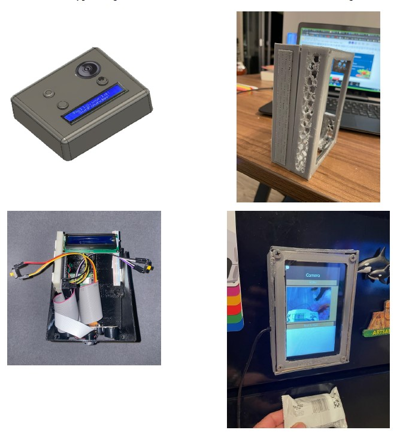
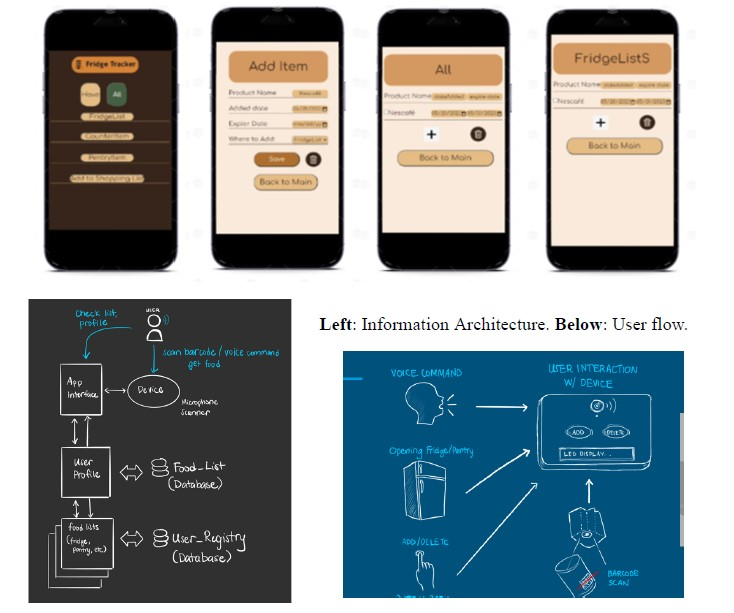

# Fridge-Tracker  
  
FridgeTracker Device: 
The FridgeTracker device has a compact and sleek design, allowing it to be easily magnetized
onto the fridge. It is lightweight and durable, designed to withstand everyday use. The device
features an integrated barcode scanner placed under the device, addressing users' security
concerns by not having a camera monitoring the kitchen. Currently, the MVP does not have solar
and a battery pack, but this is a future implementation plan. The intention is to have the battery
charged onboard to sustain power for a month. The device should also include a low-power
mode to extend battery life. Additionally, the device has a user-friendly interface, such as a
5-inch touch screen, providing visual feedback on scanning and device status as well as keeping
track of the current items added to the list. For further implementation, we are considering
incorporating temperature sensors within the device to monitor fridge temperature and send
alerts in case of temperature fluctuations. 
Mobile and Web App: 
The FridgeTracker mobile app boasts an intuitive and visually appealing user interface (UI). It
utilizes a clean and minimalist design that prioritizes ease of use and clear information
presentation. The app follows a simple 1-2-3 process to add and remove items. An onboarding
process guides users through the setup and initial scanning of their fridge items. Clear
instructions and tooltips will be provided to help users understand the app's features and
functionality. The app's information architecture (IA) is organized in a logical interaction and
search functionality to facilitate easy item retrieval will be implemented in the future, expiration
date viewing, and inventory management. 
As part of further implementation, the app will send timely notifications to users about
approaching expiration dates, low stock, or other relevant alerts. These notifications will be
customizable, allowing users to adjust their preferences. Accessibility features will be
incorporated into the app, including support for screen readers, adjustable font sizes, color
contrast options, and voice commands, making it usable for individuals with different abilities.
Additionally, there are plans to include an AI feature that suggests food recipes based on the
current ingredients—a wow factor discovered during customer interviews. 
User Experience (UX) Considerations: 
The product design prioritizes simplicity and ease of use. The number of steps required to scan
items, add them to the inventory, and view their details is minimized. Seamless syncing between
the FridgeTracker device and the mobile app ensures real-time updates and accurate inventory
management, along with maintaining a grocery shopping list. A responsive design is
implemented to ensure compatibility with different screen sizes and orientations, catering to both
smartphones and tablets. Clear and concise feedback is provided to users after each action, such
as successful item scanning, inventory updates, and expiration date reminders. User feedback
mechanisms, such as ratings, reviews, and feedback forms, are incorporated into the app to
gather insights for continuous improvement and to make users feel heard. 
Accessibility Factors: 
The product is designed to be inclusive and accessible to users with disabilities. Accessibility
guidelines are considered to ensure compliance. Clear and legible fonts, appropriate color
contrast ratios, and accessible color schemes are used to accommodate users with visual
impairments. The current app includes a toggle feature that allows users to switch between dark
and light mode. The app also supports screen readers and other assistive technologies for users
with visual or cognitive disabilities. Users are provided with customization options for the app's
interface, such as font sizes, text spacing, and color themes, to accommodate individual
accessibility needs. Thorough accessibility testing is conducted during the development process
to identify and address any potential accessibility issues.
By considering these product details and design aspects, including UI, UX, IA, and accessibility
factors, FridgeTracker can provide a seamless and user-friendly experience for individuals with
varying technical abilities. The focus on simplicity, clear feedback, and accessibility contributes
to a positive user experience, increasing the product's adoption and usability among a wide range
of users. 
Below: Mockup of App in dark and light modes. 
 
 
